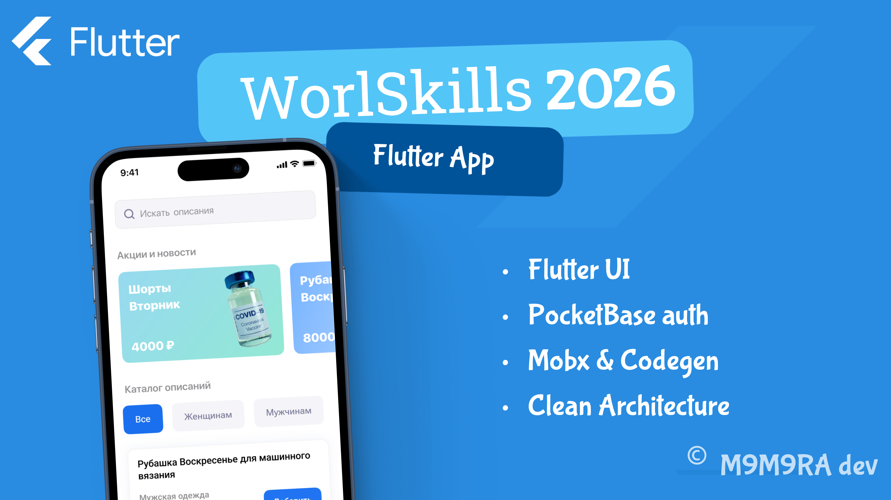
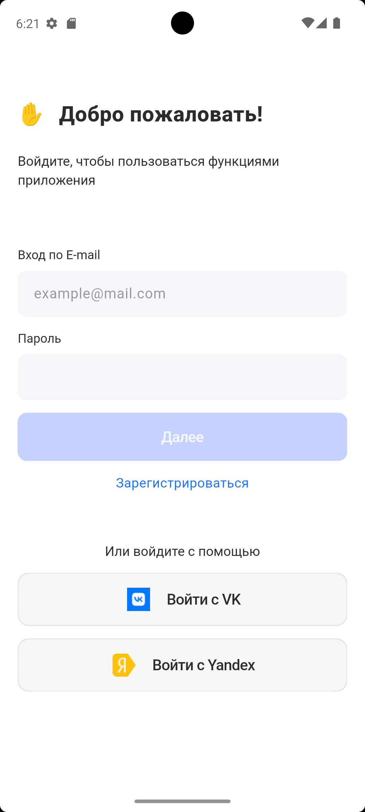
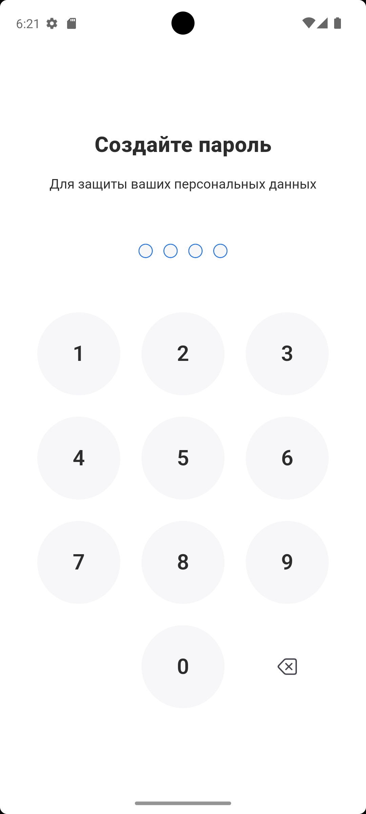
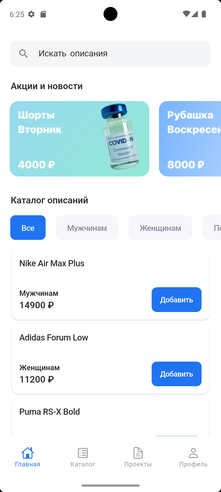
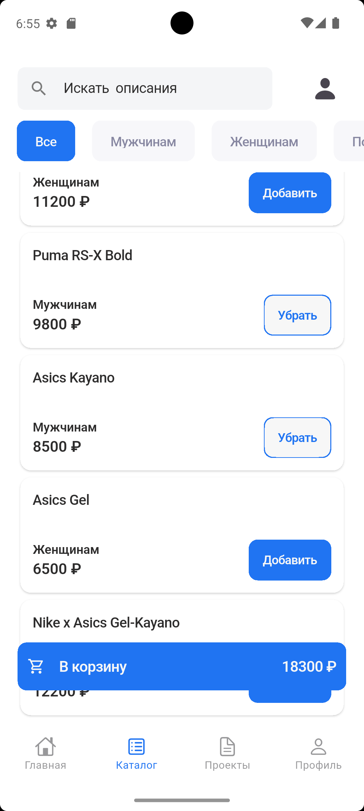
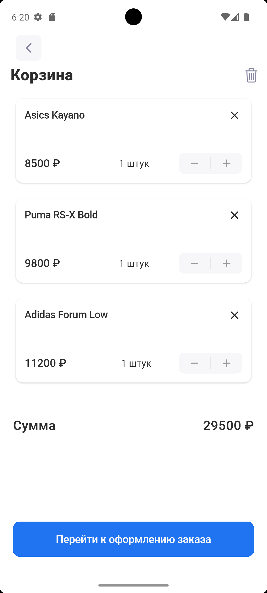
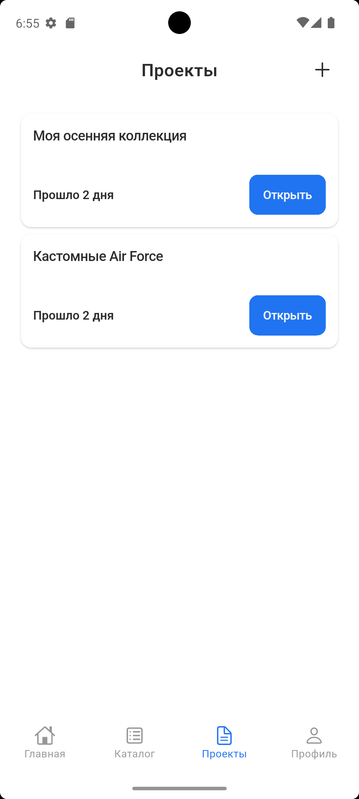
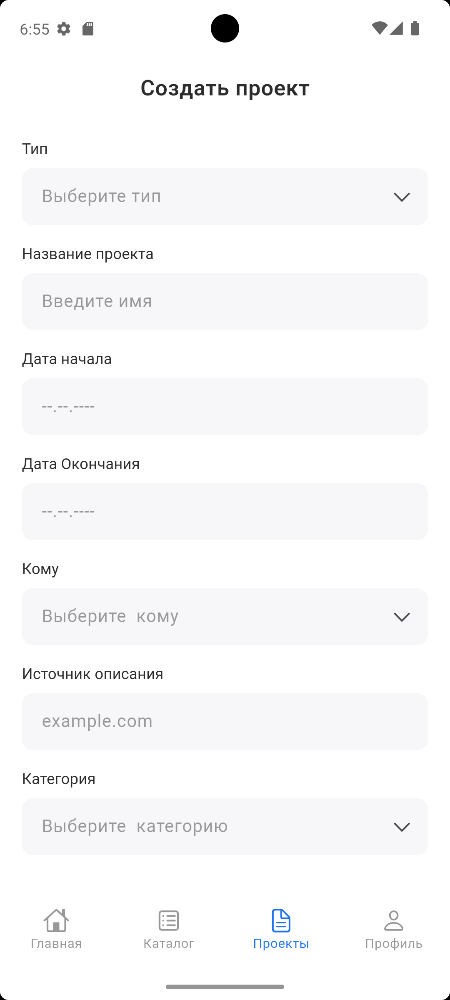
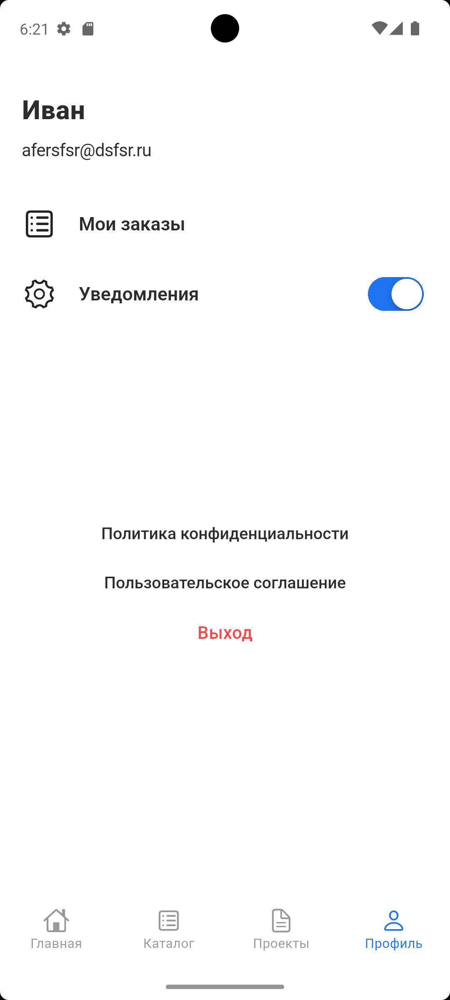

<!--
 _____ ______   ________  _____ ______   ________  ________  ________          ________  _______   ___      ___ 
|\   _ \  _   \|\  ___  \|\   _ \  _   \|\  ___  \|\   __  \|\   __  \        |\   ___ \|\  ___ \ |\  \    /  /|
\ \  \\\__\ \  \ \____   \ \  \\\__\ \  \ \____   \ \  \|\  \ \  \|\  \       \ \  \_|\ \ \   __/|\ \  \  /  / /
 \ \  \\|__| \  \|____|\  \ \  \\|__| \  \|____|\  \ \   _  _\ \   __  \       \ \  \ \\ \ \  \_|/_\ \  \/  / / 
  \ \  \    \ \  \  __\_\  \ \  \    \ \  \  __\_\  \ \  \\  \\ \  \ \  \       \ \  \_\\ \ \  \_|\ \ \    / /  
   \ \__\    \ \__\|\_______\ \__\    \ \__\|\_______\ \__\\ _\\ \__\ \__\       \ \_______\ \_______\ \__/ /   
    \|__|     \|__|\|_______|\|__|     \|__|\|_______|\|__|\|__|\|__|\|__|        \|_______|\|_______|\|__|/    
                                                                                                                
--->

# [Worldskills 2026](https://pro.firpo.ru/)  mobile app development 

[](https://m9m9ra.github.io)


<!-- 

 -->
<!-- 

 -->
[](https://opensource.org/licenses/MIT)

<!-- <a href="">

</a>
</br> -->

## О проекте

**Matule 2026** — Требования компетенции (ТК) «Разработка мобильных приложений»
определяют знания, умения, навыки и трудовые функции, которые лежат в
основе наиболее актуальных требований работодателей отрасли.

## Установка

### Требования
- Flutter SDK: ^3.8.1 или выше (до 4.0.0)
- iOS: 17.0+
- Android: 13.0+
- Подключение к интернету для начальной загрузки (опционально).

### Быстрая установка
1. Склонируйте репозиторий:
   ```bash
   git clone https://github.com/m9m9ra/worldskills_mobile_2026.git
   cd worldskills_mobile_2026
   ```
2. Установите зависимости:
   ```bash
   flutter pub get
   ```
3. Запустите приложение:
   ```bash
   flutter run
   ```

### Демо-версия

Для быстрой проверки приложения без локальной сборки вы можете установить готовую сборку на Android:

👉 **[Скачать актуальный .APK файл](ССЫЛКА_НА_ВАШ_ФАЙЛ_В_RELEASES)**

[](https://m9m9ra.github.io)

## Презентация










## Документация

### Конкурсное задание
- Можете ознакомится с конкурсной документацией по пути
  ```bash
  ./assets/publication/mobile-dev-ws-dock.pdf
  ```
### Архитектурные решения
* **Архитектура:** Clean Architecture (разделение на Data, Domain, Presentation слои).
* **State Management:** *[Provider / Native Stream, BroadCastStream]*.
* **Навигация:** *[GoRouter]*.

## Разработка

### Настройка окружения
- Установите Flutter и настройте эмуляторы или подключите устройство.
- Убедитесь, что у вас есть Xcode (для iOS) и Android SDK (для Android).

### Команды
- **Запуск разработчика:**
  ```bash
  flutter pub run build_runner watch
  ```
- **Сборка:**
  ```bash
  flutter pub run build_runner build
  ```

## Структура папок проекта 

```bash
/lib
│
├── core
│   ├── config             // Конфиги
│   └── router             // Схема навигации
│
└── layers                 // Весь бизнес и презентационный слой размещен здесь
    ├── data
    │   ├── datasource
    │   │   ├── local
    │   │   └── network
    │   └── models
    │
    ├── domain
    │   ├── models
    │   │   └── (бизнес-объекты)
    │   ├── provider 
    │   │   ├── (провайдеры точек входа)
    │   │   └── ...
    │   ├── repositories 
    │   │   ├── (интерфейсы репозиториев)
    │   │   └── ...
    │   └── usecases
    │       ├── api_usecase.dart
    │       ├── auth_usecase.g.dart
    │       └── ... (другие use case)
    │
    └── presentation
        ├── screens
        │   ├── auth
        │   ├── root_screen
        │   │   ├── widgets
        │   │   └── view
        │   ├── product_screen
        │   ├── home_screen
        │   ├── profile_screen
        │   └── ... (дополнительные экраны)
        │   └── other
        │
        └── shared
            ├── store
            └── ui
       
└── main.dart

```

### Ошибка подписи
Если есть проблемы с подписью:
```bash
flutter config --clear-ios-signing-cert
```
Затем настройте подпись в VS Code (Settings -> Flutter Guidelines).

## Сообщество
- **Issues**: [Открыть проблему](https://github.com/m9m9ra/worldskills_mobile_2026/issues)
- **Обсуждения**: [GitHub Discussions](https://github.com/m9m9ra/worldskills_mobile_2026/discussions)
- **Контакт**: [m9m9ra.dev](https://m9m9ra.github.io)

---
Copyright (c) 2026 M9M9Ra